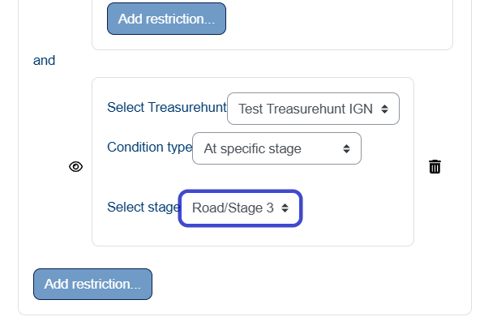

# Treasurehunt Conditional Access Plugin

This plugin allows restricting access to Moodle resources and activities based on user progress in Treasurehunt activities.

See [https://moodle.org/plugins/mod_treasurehunt](https://moodle.org/plugins/mod_treasurehunt)

## Features

- **Completed stages**: Require a minimum number of completed stages. User need to discover the geometry of at least N stages.
- **Playing time**: Require a minimum time played.
- **Full completion**: Require the treasurehunt to be completely finished. It is unlinked to activity completion.
- **Current stage: the user must be exactly in a precise stage (position discovered).
- **Return link**: When restoring the availability condition, check the description text of the activities and update the return link to restored treasurehunt activity.

## Change log
- v1.0.4 - Update return links in activities descriptions after restoration.
- v1.0.3 - Improve ajax calls and services.
- v1.0.2 - Implement privacy API. Minor fixes.
- v1.0.0 - Initial release.

## Installation

- Install from Moodle's repository.

- Install from Github repository:
1. Extract to `/availability/condition/treasurehunt/`
2. Visit the administration page to install
3. The plugin will be available in access restrictions

## Usage

1. Edit any resource or activity
2. In "Restrict access", add a new restriction
3. Select "Treasurehunt"
4. Configure the desired condition and parameters
5. Save changes

## Requirements

- Moodle 4.1+
- mod_treasurehunt plugin installed

## Author

(c) 2025 Juan Pablo de Castro <juan.pablo.de.castro@gmail.com>
